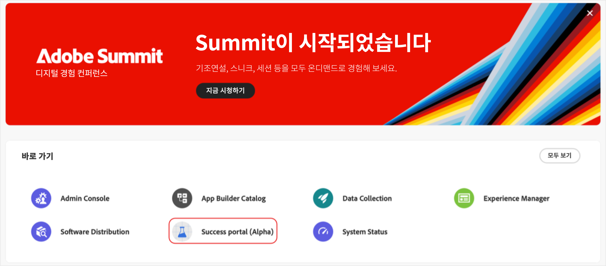

# [!DNL Adobe Success] 포털 액세스

이 안내서에서는 [!DNL Adobe Success] 포털에 로그인하고 액세스 문제가 발생하는 경우 지원을 받는 방법에 대해 설명합니다.

**[!UICONTROL 성공]** 포털 팀으로부터 액세스 확인 알림을 받게 됩니다. 이 메시지에는 로그인 세부 정보가 포함됩니다.

1. https://experience.adobe.com/으로 이동합니다.
1. Adobe ID으로 로그인합니다.
1. [!DNL Adobe Success] 포털(Alpha) 아이콘을 선택합니다.

   

1. 로그인하면 5개의 탭이 표시됩니다.

   

   * 홈
   * **[!UICONTROL 작업 계획]**
   * **[!UICONTROL 값 추적기]**
   * **[!UICONTROL 지원 및 인사이트]**
   * **[!UICONTROL 참여 계획 지원]**

## 문제 해결 및 지원

포털 또는 해당 기능에 액세스하는 데 문제가 있는 경우 [Alpha Teams 채널](https://teams.microsoft.com/l/channel/19:h-GcuAZs9uF05rervqTdx2U27ohYINuRUIfbMte9B-U1@thread.tacv2/General?groupId=02b87789-3475-47e4-94c1-0981f63ae89f&tenantId=fa7b1b5a-7b34-4387-94ae-d2c178decee1)을 사용하여 팀에 문의하세요.   

포털의 **[!UICONTROL Alpha 피드백]** 단추를 사용하여 피드백을 제출할 수 있습니다.

>[!NOTE]
>
>피드백 도구는 전용 지원 채널이 아닙니다. 긴급한 로그인 문제에는 적합하지 않습니다.

