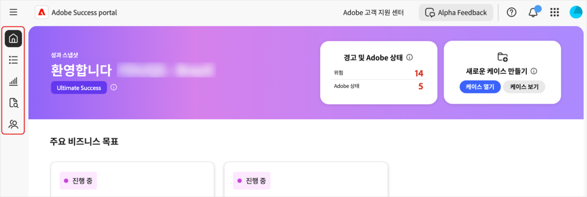
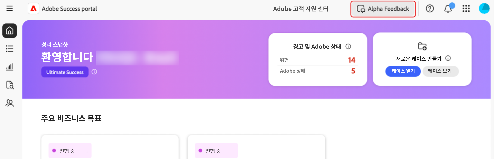

# [!DNL Adobe Success] 포털 액세스

이 안내서에서는 [!DNL Adobe Success] 포털에 로그인하는 방법과 액세스 문제가 발생할 경우 지원을 받는 방법을 설명합니다.

**[!UICONTROL Success]** 포털 팀에서 귀하의 액세스를 확인하는 알림을 받게 됩니다. 이 메시지에는 로그인 정보가 포함됩니다.

1. [https://experience.adobe.com/](https://experience.adobe.com/)으로 이동합니다.
1. Adobe ID로 로그인합니다.
1. **[!UICONTROL Success 포털 (Alpha)]** 아이콘을 선택합니다.

   ")

1. 로그인하면 5개의 탭이 표시됩니다.

   

   * 홈
   * **[!UICONTROL 행동 계획]**
   * **[!UICONTROL 가치 추적기]**
   * **[!UICONTROL 지원 및 인사이트]**
   * **[!UICONTROL 지원 참여 계획]**

## 문제 해결 및 지원

포털 또는 포털의 기능에 액세스하는 데 문제가 있는 경우 [Alpha Teams 채널](https://teams.microsoft.com/l/channel/19:h-GcuAZs9uF05rervqTdx2U27ohYINuRUIfbMte9B-U1@thread.tacv2/General?groupId=02b87789-3475-47e4-94c1-0981f63ae89f&tenantId=fa7b1b5a-7b34-4387-94ae-d2c178decee1)을 사용하여 당사의 팀에 문의하십시오.   

포털에서 **[!UICONTROL Alpha 피드백]** 버튼을 사용하여 피드백을 제출할 수 있습니다.

>[!NOTE]
>
>피드백 도구는 전담 지원 채널이 아닙니다. 긴급한 로그인 문제에 사용하기는 적합하지 않습니다.

