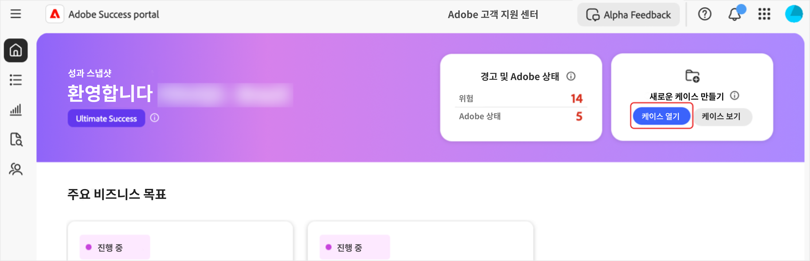
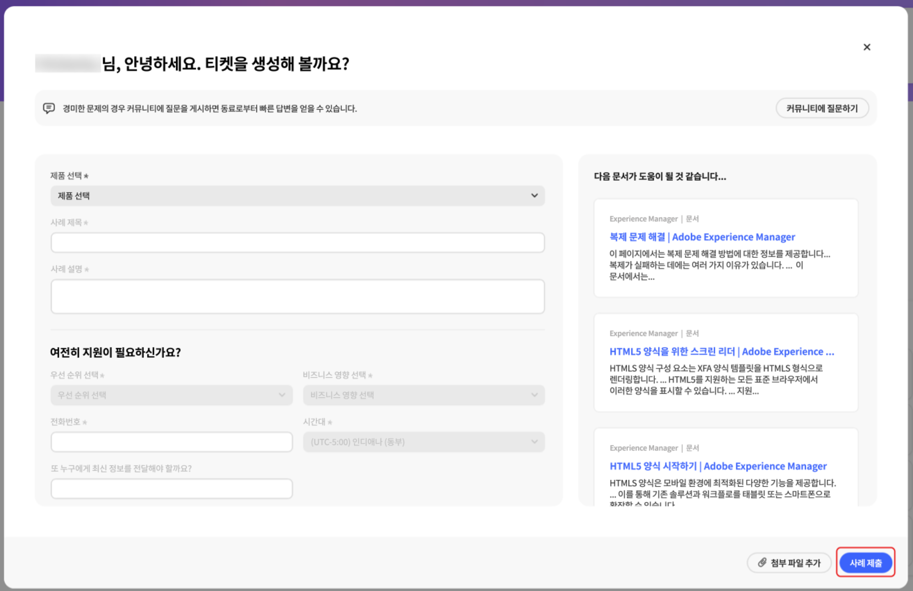
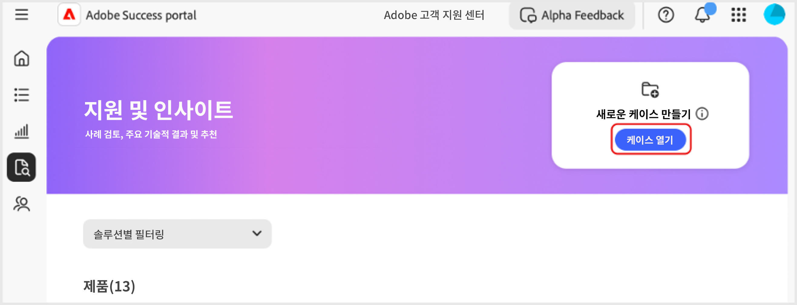
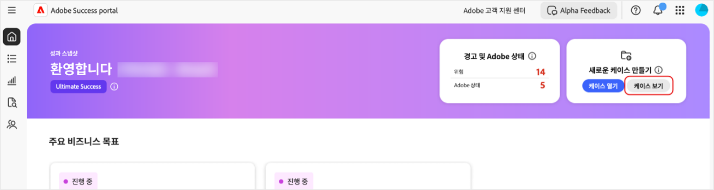
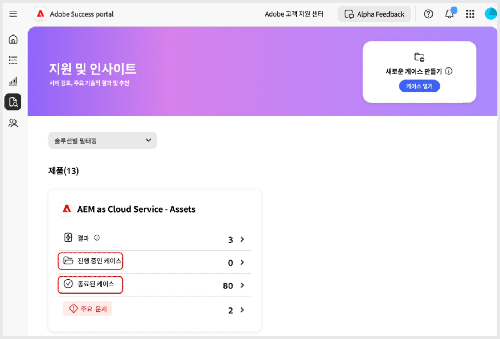
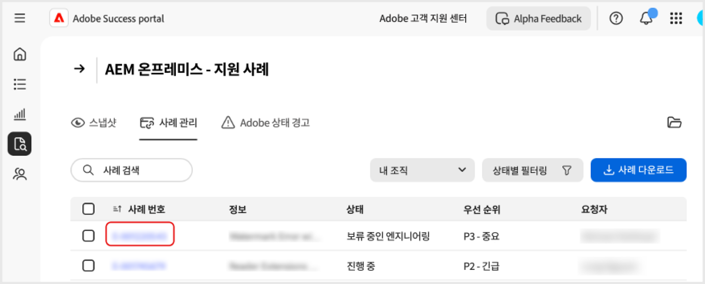
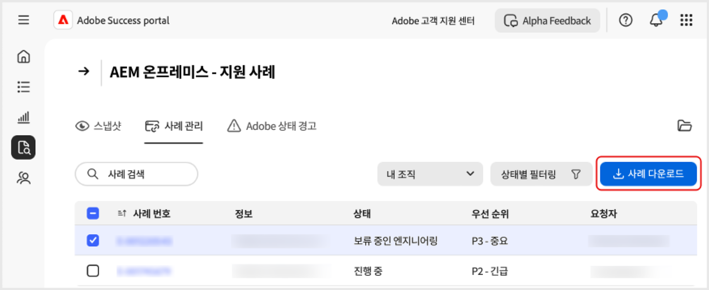

# [!DNL Adobe Success] 포털에서 사례 만들기 및 관리

이 안내서에서는 [!DNL Adobe Success] 포털에서 사례에 대한 보고서를 만들고 보고 다운로드하는 방법을 설명합니다.

## 사례 열기

홈 탭 또는 **[!UICONTROL 지원 및 인사이트]** 탭에서 사례를 열 수 있습니다.

홈 탭에서 **[!UICONTROL 진행 중인 사례]** 페이지에 액세스하려면:

1. 홈 탭으로 이동합니다.
1. **[!UICONTROL 진행 중인 사례]**&#x200B;를 선택합니다.

   

1. 필수 입력 필드를 채웁니다.
   1. **[!UICONTROL 제품 선택]**.
   1. **[!UICONTROL 사례 제목]**.
   1. **[!UICONTROL 사례 설명]**
1. **[!UICONTROL 사례 제출]**&#x200B;을 선택합니다.

   

**[!UICONTROL 지원 및 인사이트]** 탭에서 **[!UICONTROL 진행 중인 사례]** 페이지에 액세스하려면:

1. **[!UICONTROL 지원 및 인사이트]** 탭으로 이동합니다.
1. **[!UICONTROL 진행 중인 사례]**&#x200B;를 선택합니다.

   

위와 동일한 단계에 따라 사례를 완료하고 제출합니다.

## 사례 보기

홈 탭 또는 **[!UICONTROL 지원 및 인사이트]** 탭에서 사례를 볼 수 있습니다.

홈 탭에서 **[!UICONTROL 사례 보기]** 페이지에 액세스하려면:

1. 홈 탭으로 이동합니다.
1. **[!UICONTROL 사례 보기]**&#x200B;를 선택합니다.

   

1. 보려는 제품 카드를 선택한 다음 **[!UICONTROL 진행 중인 사례]** 또는 **[!UICONTROL 마감된 사례]**&#x200B;를 선택합니다.

   >[!NOTE]
   >
   >또한 **[!UICONTROL 지원 및 인사이트]** 탭을 선택하여 **[!UICONTROL 진행 중인 사례]** 또는 **[!UICONTROL 마감된 사례]** 링크가 있는 제품 카드에 빠르게 액세스할 수 있습니다.

   

1. 사례 세부 정보를 보려면 **[!UICONTROL 사례 번호]** 를 클릭합니다.

   

## 사례 보고서 다운로드

사례에 대한 PDF 보고서를 다운로드하려면:

1. 홈 탭으로 이동합니다.
1. **[!UICONTROL 사례 보기]**&#x200B;를 선택합니다.

   

1. 보려는 제품 카드를 선택한 다음 **[!UICONTROL 진행 중인 사례]** 또는 **[!UICONTROL 마감된 사례]**&#x200B;를 선택합니다.

   >[!NOTE]
   >
   >또한 **[!UICONTROL 지원 및 인사이트]** 탭을 선택하여 **[!UICONTROL 진행 중인 사례]** 또는 **[!UICONTROL 마감된 사례]** 링크가 있는 제품 카드에 빠르게 액세스할 수 있습니다.

   

1. [제품] - 지원 사례 페이지에서 다운로드하려는 사례 옆에 있는 확인란을 선택하고 **[!UICONTROL 사례 다운로드]**&#x200B;를 선택합니다.

   
