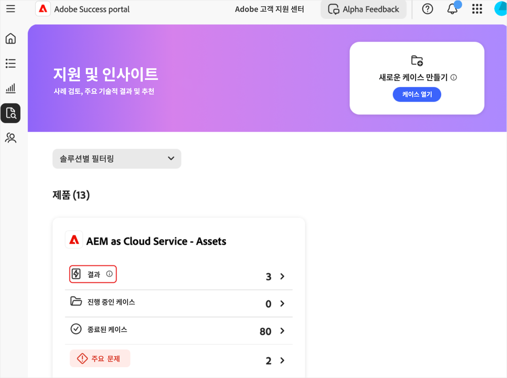
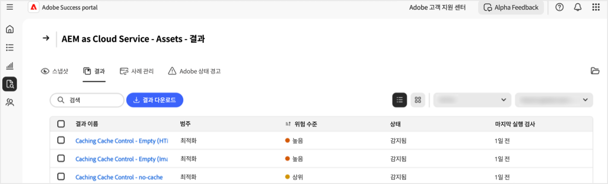
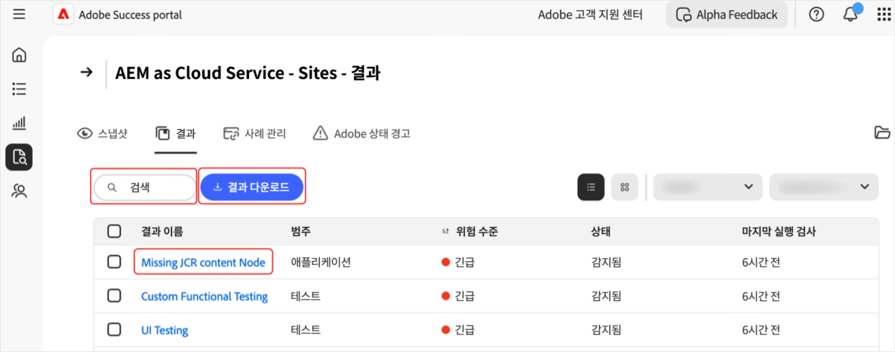
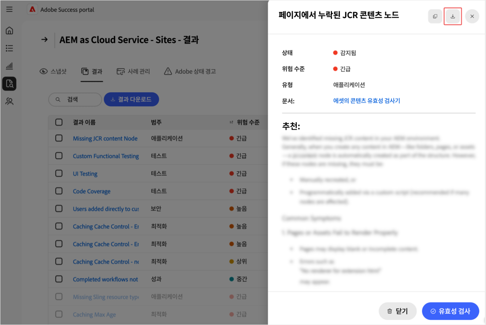
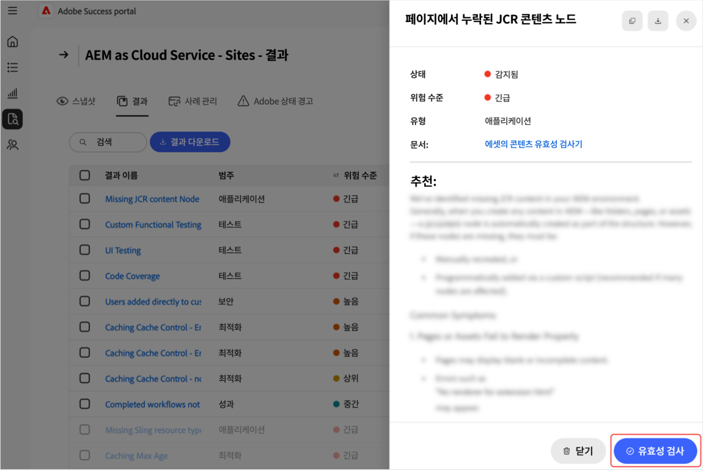

# [!DNL Adobe Success] 포털에서 검색 결과 관리

이 안내서에서는 제품 성능, 보안 및 기능 위험을 사전 예방적으로 관리하는 데 도움이 되는 [!DNL Adobe Success] 포털의 검색 결과에 액세스하고 해석하고 실행하는 방법을 설명합니다.

[!DNL Adobe Success] 포털 **[!UICONTROL 결과]** 페이지에는 Adobe 제품 인스턴스에서 발견된 문제 또는 위험이 표시됩니다. 조사 결과에는 상태 및 위험 수준과 함께 성능, 보안 및 기능 문제가 포함됩니다. 이 페이지를 모니터링하면 환경에 영향을 미치기 전에 문제를 조기에 해결할 수 있습니다.

**검색 결과는 무엇입니까?**

결과는 [!DNL Adobe Success] 포털에 표시된 지원 인사이트 경고입니다. 성능 저하, 보안 위험 또는 잘못된 구성과 같은 Adobe 제품 설정의 잠재적 문제를 강조합니다. 이러한 경고는 API, [!DNL New Relic] 및 [!DNL Splunk]과(와) 같은 도구에서 수집된 원격 분석 데이터를 기반으로 합니다.

**검색 결과를 만드는 방법은 무엇입니까?**

Adobe 팀은 가장 일반적인 지원 문제와 트렌드를 정기적으로 조사합니다. 통찰력을 기반으로 시스템에 새 검사를 추가합니다. [!DNL Adobe Success] 포털은 매일 한 번 제품 데이터를 스캔하여 구성 오류, 중단 작업 또는 시스템 중단으로 이어질 수 있는 모든 문제를 감지합니다. Adobe의 제품 및 지원 팀에서 정의한 안전 범위 밖에 있는 것을 확인하면 검색 결과로 표시됩니다.

**결과가 중요한 이유**

정기적으로 결과를 검토하면 문제가 시스템이나 고객에게 영향을 미치기 전에 문제를 조기에 발견하는 데 도움이 됩니다. 이 사전 예방적 접근 방식은 시스템 안정성을 향상시키고, 다운타임을 줄이고, 모범 사례를 지원합니다.

**결과를 수정하는 방법**

각 검색 결과에는 관련 설명서에 대한 링크와 함께 문제를 해결하는 방법에 대한 권장 사항 및 명확한 지침이 포함되어 있습니다. 이러한 결과를 IT, 엔지니어링 팀 또는 Adobe 파트너와 공유하고 공동 작업하여 해결하십시오. 이러한 문제를 조기에 해결하면 더 큰 문제를 방지하고 시스템이 원활하게 작동할 수 있습니다.

## 액세스 결과

제품에 대한 인사이트를 보려면 다음 작업을 수행하십시오.

1. **[!UICONTROL 지원 및 인사이트]**(으)로 이동합니다.
1. 관련 제품 카드를 선택합니다. **[!UICONTROL 결과]** 탭을 선택합니다.

   

1. 선택한 제품에 대한 모든 검색 결과 목록이 표시됩니다.

   

1. 여기에서 다음 작업을 수행할 수 있습니다.

   

   * 특정 항목을 검색합니다.
   * **[!UICONTROL 결과 다운로드]**&#x200B;를 선택하여 결과 목록을 내보냅니다. 하나의 검색 결과에 대한 보고서를 내보내려면 **[!UICONTROL 검색 결과 이름]** 열에서 관련 검색 결과 옆에 있는 확인란을 선택하십시오. 검색 결과를 선택하지 않으면 기본적으로 PDF에 모든 검색 결과 목록이 포함됩니다.
   * **[!UICONTROL 검색 이름]**&#x200B;에서 검색 결과를 선택하여 권장 해결 방법을 포함한 검색 결과에 대한 세부 정보를 참조하십시오. [검색 결과 세부 정보] 페이지에는 추가 컨텍스트와 권장 사항이 있는 선택된 검색 결과가 표시됩니다. 이 보고서를 보려면 다운로드 화살표를 선택합니다.

     

## 작업 결과

다음 단계에 따라 각 검색 결과가 여전히 적용되는지 또는 기각될 수 있는지 확인합니다.

>[!NOTE]
>:
>
>표준 검사는 인스턴스에서 실행됩니다. 검사 결과 인스턴스에 문제가 있음을 찾지 못하면 **[!UICONTROL 감지되지 않음]** 상태가 됩니다.

1. **[!UICONTROL 지원 및 인사이트]**(으)로 이동합니다.
1. 관련 제품 카드를 선택합니다.
1. **[!UICONTROL 결과]** 탭을 엽니다. 선택한 제품에 대한 모든 검색 결과가 표시됩니다.
1. **[!UICONTROL 검색 이름]**&#x200B;에서 항목을 선택하십시오. [검색 결과 세부 정보] 페이지에서는 다음 작업을 수행할 수 있습니다.
   * **[!UICONTROL 유효성 검사]**&#x200B;를 선택하여 문제가 아직 있는지 확인합니다(**[!UICONTROL 유효성 검사]** 단추는 문제가 해결되었음을 확인하는 것으로 디자인됨).

   

   * 문제가 계속 발생하면 다음 메시지가 표시됩니다. *[!UICONTROL 유효성 검사가 완료되었습니다.]*&#x200B;이(가) 계속 검색됩니다. 검색 결과 세부 정보 페이지의 정보 및 권장 사항을 사용하여 조사하고 해결할 수 있습니다.
   * 문제가 더 이상 발생하지 않으면 *[!UICONTROL 유효성 검사 완료 메시지가 표시됩니다. 검색 결과]*&#x200B;이(가) 더 이상 발견되지 않습니다. 검색 결과가 더 이상 검색되지 않으면 검색 결과가 회색으로 표시되고 상태가 **[!UICONTROL 검색되지 않음]**(으)로 변경됩니다. **[!UICONTROL 감지되지 않음]** 상태의 검색 결과는 검색 결과 목록의 맨 아래에 있습니다.
   * 문제를 적용할 수 없거나 관련된 경우 **[!UICONTROL 취소]**&#x200B;를 선택하여 취소할 수 있습니다. 검색 결과가 무시되면 검색 결과가 회색으로 표시되고 상태가 **[!UICONTROL 무시됨]**(으)로 변경됩니다.  **[!UICONTROL 기각됨]** 상태의 검색 결과는 검색 결과 목록의 맨 아래에 있습니다.

## 결과 이해

* **[!UICONTROL 이름 찾기]** - 자세한 인사이트 및 권장 해결 단계를 선택하십시오.
* **[!UICONTROL 유형]** - *기능*, *성능* 및 *보안*&#x200B;으로 분류됩니다.
* **[!UICONTROL 위험 수준]** - 심각도 지표(시각적 표시기가 있음).
* **[!UICONTROL 상태]** - 검색 결과의 현재 상태(예: *감지됨*, *감지되지 않음*, *기각됨*).
* **[!UICONTROL 마지막 실행 확인]** - 검색 결과를 업데이트한 마지막 확인 타임스탬프입니다.

## 모범 사례

**[!UICONTROL 검색 결과]** 페이지에 위험 수준이 **[!UICONTROL 높음]**, **[!UICONTROL 높음]** 및 **[!UICONTROL Medium]**&#x200B;인 권장 사항이 나열됩니다. **[!UICONTROL 높음]**&#x200B;은(는) 중요하고, **[!UICONTROL 높음]**&#x200B;은(는) 긴급하며, **[!UICONTROL Medium]**&#x200B;은(는) 중요하지 않습니다. 사이트 상태 및 성능을 유지하려면 다음 작업을 수행하십시오.

* 심각한 위협을 가하는 **[!UICONTROL 높은 위험]** 결과를 즉시 해결하십시오.
* 에스컬레이션을 방지하려면 **[!UICONTROL 높음]** 위험 문제를 곧 해결하세요.
* **[!UICONTROL Medium]** 위험 검색 결과를 정기적으로 모니터링하고 필요에 따라 조치를 취합니다.

