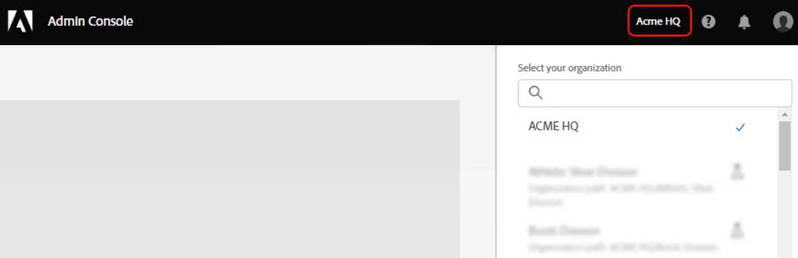

# Adobe Admin Console 개요

엔터프라이즈 및 팀에 적용됩니다.

Adobe Admin Console은 조직 전체에서 Adobe 권한을 관리하기 위한 중앙 위치입니다. 이를 사용하여 라이선스, 사용자 및 결제를 관리할 수 있습니다. [Admin Console에 로그인](https://adminconsole.adobe.com)하려면 여기로 이동하세요. 자세한 내용은 다음 [비디오](https://helpx.adobe.com/enterprise/using/admin-console.html)를 참조하세요.

Admin Console의 각 탭에서는 다양한 작업을 수행할 수 있습니다. 자세한 내용은 아래 제목을 선택하십시오.

- [!UICONTROL 개요] {#overview}: 구입한 라이선스의 요약과 조직을 설정하는 빠른 작업을 봅니다.

- [!UICONTROL 제품] {#products}: 사용자 및 그룹에 라이선스를 할당합니다. 엔터프라이즈 고객은 제품 프로필을 관리할 수 있습니다.

- [!UICONTROL 사용자] {#users}: 최종 사용자에게 Adobe 제품 및 서비스 권한을 부여하는 사용자 계정을 만들고, 업데이트하고, 제거합니다.

- [!UICONTROL 패키지] {#packages}: 미리 구성된 패키지를 다운로드하거나 배포하려는 데스크톱 앱용으로 만듭니다.

- [!UICONTROL 계정] {#account}: Adobe과의 계약 및 계약을 관리합니다.

- [!UICONTROL 저장소] {#storage}: 개별 사용자 폴더 및 공유 폴더를 관리하고 사용자가 사용하는 저장소 할당량을 봅니다.

- [!UICONTROL Insights] {#insights}: 라이선스 할당 보고서를 보고, 만들고, 다운로드하고, Admin Console에서 변경한 내용을 추적합니다.

- [!UICONTROL 설정] {#settings}: 도메인을 클레임하고, 공유 기능에 대한 액세스를 제한하고, 최종 사용자를 위한 메모를 추가하고, 암호 보호 수준을 설정합니다.

Admin Console에 로그인할 수 없는 경우 [Adobe 계정 로그인 문제 해결](https://helpx.adobe.com/manage-account/kb/account-password-sign-help.html)을 참조하세요.

## [!UICONTROL 개요] {#overview}

**[!UICONTROL 개요]** 탭에는 제품 라이선스에 대한 다양한 정보가 효율적으로 표시됩니다. 플랜에 있는 라이센스의 상태(사용 가능한 총 라이센스 중 할당된 라이센스의 수)가 표시됩니다. 사용자 및 관리자를 추가하는 데 사용할 수 있는 몇 가지 빠른 링크도 있습니다.

## 조직 선택

관리자는 여러 조직에 속할 수 있습니다. 회사에 별도의 조직으로 존재하는 여러 자회사가 있거나 각 자회사에 별도의 사용권 계약이 있는 경우 모든 사용자에게 동일한 관리자를 지정할 수 있습니다.

여러 조직의 관리자인 경우 조직 선택기를 사용하여 조직 간에 전환할 수 있습니다. 선택한 조직은 조직 이름 옆에 녹색 확인 표시가 표시됩니다.

조직이 Global Admin Console의 일부인 경우 조직 이름 옆에 계층 아이콘이 표시됩니다. 또한 조직의 경로를 보고 계층 내에서 조직의 배치를 결정할 수 있습니다. 예를 들어 스크린샷에서 관리자는 조직 B의 멤버이고 이 조직의 Global Admin Console 경로는 A > B입니다. 여기서 B는 조직 A의 하위 항목입니다.

복잡한 조직 구조에 많은 Admin Console이 있거나 기본 Admin Console을 여러 콘솔로 나누려는 경우 [Global Admin Console을 채택](https://helpx.adobe.com/enterprise/global-admin-console/adopt-global-administration.html)할 수 있습니다. 예를 들어, 다국적 기업, 교육 컨소시엄, 대규모 학군, 대형 정부 기관 등이 이에 해당한다. Global Admin Console은 기존 Admin Console을 조직 차트와 같은 계층 구조로 중첩하여 분산 엔터프라이즈 전반에 걸쳐 투명성을 제공합니다.

## [!UICONTROL 제품] {#products}

시스템 관리자, 제품 관리자 및 제품 프로필 관리자 탭을 볼 수 있는 사람.

Enterprise {#enterprise}

**[!UICONTROL Admin Console]**&#x200B;의 [제품](https://adminconsole.adobe.com) 페이지에서는 제품 및 제품 프로필을 관리하는 옵션을 제공합니다. 제품 프로필을 사용하면 플랜에서 사용할 수 있는 Adobe 애플리케이션 및 서비스의 전체 또는 하위 집합을 활성화하고 제공된 제품 또는 플랜과 관련된 설정을 사용자 지정할 수 있습니다. 그런 다음 제품 관리자라는 관리자를 제품 프로필에 할당할 수 있습니다. 이러한 관리자는 관리하는 제품 프로필에 최종 사용자를 추가합니다.

자세한 내용은 다음 문서를 참조하십시오.

- [제품 관리](https://helpx.adobe.com/kr/enterprise/using/manage-products.html)
- [제품 프로필 관리](https://helpx.adobe.com/enterprise/using/manage-product-profiles.html)

팀 {#teams}

**[!UICONTROL Admin Console]**&#x200B;의 [제품](https://adminconsole.adobe.com) 페이지에서 사용자에게 제품 라이선스를 할당할 수 있습니다. 사용자 또는 그룹에 제품 라이선스를 할당하려면 **[!UICONTROL 제품]** 페이지에서 원하는 제품을 선택하고 **[!UICONTROL 사용자 추가]**&#x200B;를 클릭하십시오.

사용자의 이름 또는 이메일 주소를 입력합니다. 유효한 이메일 주소를 지정하고 화면에 정보를 입력하여 기존 사용자를 검색하거나 사용자를 추가할 수 있습니다. **[!UICONTROL 저장]**&#x200B;을 클릭합니다. 애플리케이션에 대한 액세스를 확인하는 이메일이 사용자 또는 그룹에 전송됩니다.

자세한 내용은 다음 문서를 참조하십시오.

- [라이선스 할당 또는 할당 해제](https://helpx.adobe.com/enterprise/using/assign-licenses-to-teams-users.html)
- [제품 또는 라이선스 추가 또는 제거](https://helpx.adobe.com/enterprise/using/add-products-and-licenses.html)

## [!UICONTROL 사용자] {#users}

**[!UICONTROL Admin Console]**&#x200B;의 [사용자](https://adminconsole.adobe.com) 페이지에서는 사용자 계정을 만들고, 검색하고, 업데이트하고, 제거할 수 있습니다. 이러한 사용자 계정은 조직의 최종 사용자에게 Adobe 제품 및 서비스 권한을 부여합니다. 워크플로우 벌크 편집 을 사용하여 사용자를 추가하거나 사용자 세부 사항 및 라이선스 할당을 수정할 수도 있습니다.

자세한 내용은 다음 문서를 참조하십시오.

- [사용자 관리](https://helpx.adobe.com/kr/enterprise/using/users.html)
- [사용자 그룹 관리](https://helpx.adobe.com/kr/enterprise/using/user-groups.html)

## [!UICONTROL 계정] {#account}

이 탭을 볼 수 있는 사람: 시스템 관리자 및 계약 관리자.

시스템 및 계약 관리자는 Admin Console의 **[!UICONTROL 계정]** 탭에서 조직의 Adobe 계약을 관리할 수 있습니다.

Enterprise, VIP, VIP Marketplace 또는 Teams 등 계획에 따라 다음과 같은 작업을 수행할 수 있습니다.

- 계약 ID, 상태, 기념일/종료일, 앱 및 라이선스 등 주요 계약 세부 정보를 봅니다.
- 더 쉽게 식별할 수 있도록 계약의 표시 이름을 변경합니다.
- 계약 관리자를 추가하거나 제거합니다.
- 지급 상세내역, 송장 및 갱신을 관리합니다.
- Adobe 계정 관리자의 연락처 세부 정보를 봅니다.

자세히 알아보기: [계정 관리](https://helpx.adobe.com/enterprise/using/accounts.html).

## [!UICONTROL Insights] {#insights}

이 탭을 볼 수 있는 사람: 시스템 관리자.

### [!UICONTROL 감사 로그] {#audit-log}

**[!UICONTROL 감사 로그]**&#x200B;를 통해 지속적인 규정 준수를 보장하고 부적절한 시스템 액세스를 방지하며 조직 내에서 의심스러운 행동을 감사할 수 있습니다.

시스템 관리자는 [Admin Console](https://adminconsole.adobe.com/)에서 변경한 내용을 모두 볼 수 있습니다. 작업 유형, 발생 시간 및 만든 사람을 기준으로 감사 로그를 검색할 수 있습니다.

그런 다음 추가 분석을 위해 이러한 보고서를 보고 다운로드합니다. 자세히 알아보기: [감사 로그를 사용하여 사용자 할당 및 이벤트를 추적합니다](https://helpx.adobe.com/enterprise/using/audit-logs.html).

### [!UICONTROL 할당 보고서] {#assignment-reports}

라이선스 할당 보고서를 사용하여 조직의 라이선스 할당 데이터를 추적하고 사용자의 라이선스 배포를 계획할 수 있습니다. 라이선스 할당 데이터는 Enterprise Term License Agreement에 따라 구입한 Creative Cloud 및 Document Cloud 제품에 대해 명명된 사용자 라이선스만 지원합니다.

자세히 알아보기: [Enterprise 제품에 대한 라이선스 할당 보고서](https://helpx.adobe.com/enterprise/using/assignment-reports.html).

## [!UICONTROL 저장소] {#storage}

이 탭을 볼 수 있는 사람: 시스템 관리자 및 스토리지 관리자([풀링된 스토리지 모델로 마이그레이션한 고객만 해당](https://helpx.adobe.com/enterprise/using/manage-adobe-storage.html)).

**[!UICONTROL Admin Console]**&#x200B;의 [저장소 페이지](https://adminconsole.adobe.com)을(를) 통해 Creative Cloud 응용 프로그램 전반의 저장소를 볼 수 있습니다. 스토리지 할당량은 조직에서 구매한 스토리지 용량까지 최종 사용자가 유연하게 사용할 수 있습니다.

개별 사용자가 사용한 할당량과 모든 사용자가 사용한 전체 할당량을 볼 수도 있습니다.

자세히 알아보기: [Adobe 저장소 관리](https://helpx.adobe.com/enterprise/using/manage-adobe-storage.html).

## [!UICONTROL 패키지] {#packages}

시스템 관리자 및 배포 관리자 탭을 볼 수 있는 사람.

**[!UICONTROL Admin Console]**&#x200B;의 [패키지](https://adminconsole.adobe.com) 페이지에서는 다음 기능을 제공합니다. 조직의 최종 사용자에게 데스크탑 애플리케이션을 배포하려는 경우 사용합니다.

- [Adobe 템플릿](https://helpx.adobe.com/enterprise/using/package-templates.html)을(를) 사용하여 미리 구성된 패키지를 다운로드합니다.
- 최종 사용자에게 제공할 구성 및 응용 프로그램을 사용하여 사용자 지정 [명명된 사용자 라이선스](https://helpx.adobe.com/enterprise/using/create-nul-packages.html) 또는 [공유 장치](https://helpx.adobe.com/enterprise/using/create-sdl-packages.html) 라이선스(교육 기관용)를 만듭니다.
- 이메일 알림을 활성화하면 새 제품 버전을 사용할 수 있게 될 때 알림을 받게 됩니다.
- 귀하 또는 조직의 다른 관리자가 만든 이전 패키지를 봅니다. 또한 특정 패키지의 세부 정보를 보고 패키지에 있는 앱에 대해 사용 가능한 업데이트를 추적합니다.
- [원격 업데이트 관리자](https://helpx.adobe.com/enterprise/using/using-remote-update-manager.html) 및 [Adobe 업데이트 서버 설치 도구](https://helpx.adobe.com/enterprise/using/update-server-setup-tool.html)와 같은 IT 도구를 다운로드하십시오.
- Adobe Extension Manager 명령줄 도구를 다운로드하여 ZXP 파일 컨테이너 형식에서 [확장 기능 및 플러그 인을 설치](https://helpx.adobe.com/enterprise/using/manage-extensions.html)합니다.

자세한 내용은 [Admin Console을 통해 앱 패키징](https://helpx.adobe.com/enterprise/using/package-apps-admin-console.html)을 참조하십시오.

## [!UICONTROL 설정] {#settings}

시스템 관리자 및 스토리지 관리자 탭을 볼 수 있습니다.

저장소 관리자는 [자산 설정](https://helpx.adobe.com/enterprise/using/asset-settings.html) 및 [콘텐츠 로그](https://helpx.adobe.com/enterprise/using/content-logs.html)에만 액세스할 수 있습니다. 시스템 관리자는 계획에 따라 설정을 보거나 수정할 수 있습니다.

>[!NOTE]
>
> Adobe은 최상위 수준 관리자가 현재 Admin Console 설정을 Adobe의 권장 보안 기본값과 비교할 수 있는 기본 기능을 제공하지 않습니다. 관리자는 Adobe의 권장 구성 지침을 참조하여 조직의 ID 공급자, 엔드포인트 관리 도구 및 내부 감사 프로세스를 사용하여 규정 준수를 확인할 수 있습니다.

## 개인 정보 및 보안 연락처 {#privacy-and-security-contacts}

소프트웨어 솔루션과 관련된 보안 사고가 발생하면 해당 규정 준수 담당자에게 알림이 전송됩니다. 시스템 관리자로서 신속한 알림을 받으려면 보안, 데이터 보호 및 규정 준수 책임자를 지정해야 합니다. 자세한 내용은 [개인 정보 및 보안 연락처](https://helpx.adobe.com/enterprise/using/security-contacts.html)를 참조하세요.

## [!UICONTROL 콘솔 설정] {#console-settings}

[[!UICONTROL 콘솔 설정]](https://helpx.adobe.com/enterprise/using/console-settings.html)을 사용하면 최종 사용자가 문제가 발생하거나 지원이 필요한 경우 지원을 받는 방법에 대해 최종 사용자와 통신할 수 있도록 사용자 지정 메모를 추가할 수 있습니다.

구독 변경 또는 신용 카드 만료와 같은 계정 상태에 대한 이메일을 받으려면 조직의 기본 이메일 언어를 선택하십시오. Adobe에서 직접 구입한 팀 멤버십이 있는 경우 **[!UICONTROL 콘솔 설정]**&#x200B;에서 팀 이름을 변경할 수 있습니다.

## [!UICONTROL 개의 콘텐츠 로그] {#content-logs}

관리자는 최종 사용자가 폴더, 파일 및 라이브러리와 같은 회사 에셋으로 작업하는 방법에 대한 자세한 보고서를 다운로드할 수 있습니다. 이러한 보고서를 [[!UICONTROL 콘텐츠 로그]](https://helpx.adobe.com/enterprise/using/content-logs.html)라고 합니다.

## 도메인 적용 {#domain-enforcement}

시스템 관리자는 조직 소유 도메인을 제한하여 사용자가 개인 Adobe ID 계정을 만들고 사용하지 못하도록 할 수 있습니다. 이렇게 하면 개인 데이터의 사용이 제한되고, 보안이 강화되며, 조직 사용자 간에만 에셋을 공유할 수 있습니다.

자세히 알아보기: [제한된 인증에 대한 도메인 적용](https://helpx.adobe.com/enterprise/using/restricting-domains.html).

## ID {#identity}

[ID 형식](https://helpx.adobe.com/kr/enterprise/using/identity.html)을 통해 조직에서 사용자의 계정 및 데이터를 다양한 수준으로 제어할 수 있습니다. 조직이 자산을 저장하고 공유하는 방식에 영향을 줍니다.

## [!UICONTROL 자산 설정] {#asset-settings}

[자산 설정](https://helpx.adobe.com/enterprise/using/asset-settings.html)을 통해 조직의 직원이 조직 외부에서 자산을 공유하는 방법을 제어할 수 있습니다. 에셋 설정은 다른 조직 정책 시행 시스템(Adobe에서 제공되지 않음)과 함께 사용되어 에셋이 적절한 외부 개인 및 조직과만 공유되도록 합니다.

## 인증 설정 {#authentication-settings}

[인증 설정](https://helpx.adobe.com/enterprise/using/authentication-settings.html)은(는) 안전 및 보안을 보장하기 위해 여러 암호 보호 수준 및 정책을 지원합니다. 조직의 모든 사용자에게 적용할 암호 보호 수준을 지정할 수 있습니다.

## 암호화 설정 {#encryption-settings}

[암호화 설정](https://helpx.adobe.com/enterprise/using/encryption.html)은(는) 제어 및 보안의 추가 계층을 위한 전용 암호화 키를 생성합니다.

## 프로젝트 정책 {#project-policies}

시스템 관리자는 조직에서 프로젝트를 만들고 관리할 권한이 있는 사용자를 제어할 수 있습니다. 기본적으로 Admin Console에 추가된 모든 사용자는 프로젝트를 만들고 관리할 수 있습니다.

자세히 알아보기: [프로젝트 정책](https://helpx.adobe.com/enterprise/using/projects-in-business-storage.html#project-policies).

## 지원

Adobe 고객 지원 센터에 문의하려면 다음을 수행할 수 있는 [Admin Console](https://adminconsole.adobe.com/)의 지원 페이지로 이동하십시오.

- 지원 사례 관리(기업만 해당)
- 사례 만들기(Enterprise만 해당)
- Adobe 고객 지원 센터 담당자와 연결
- 전문가 세션 예약
- 인기 있는 도움말 항목 및 포럼 찾아보기

지원 옵션에 대한 자세한 내용은 [지원 및 전문가 세션](https://helpx.adobe.com/enterprise/using/support-and-expert-services.html)을 참조하세요.
