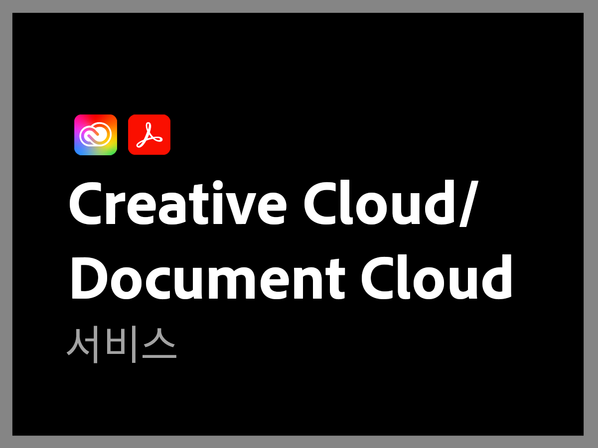

# 이전 Adobe 지원 플랜 개요

>[!NOTE]
>
>이 플랜은 2022년 6월 16일 이전의 Adobe 지원 플랜을 나타냅니다. 현재 지원 플랜은 [Adobe 지원 서비스 개요](overview.md)를 참조하십시오.

Adobe 지원 조직은 귀사의 성공을 위해 최선을 다하고 있습니다. 모든 구독에는 기술 지원을 위해 고도로 숙련된 기술 리소스에 쉽게 액세스할 수 있도록 하는 수준의 지원이 포함됩니다.

보다 포괄적인 요구 사항의 경우, 지정 지원 전문가에 대한 액세스, 사전 멘토링 및 서비스 검토 세션이 포함된 Adobe 지원 서비스를 제공합니다. 지원 요구 사항이 아무리 복잡하더라도 Adobe는 Adobe 솔루션에서 최고의 성능과 최적의 가치를 달성하는 데 필요한 기술 및 운영 전문 지식을 제공합니다.

<table style="table-layout:fixed">
<tr>
  <td>
    
    

    <a href="dx-overview.md"><strong>Experience Cloud 지원</strong></a>
    

    
Experience Cloud 및 Experience Platform 제품에 대한 지원 옵션

     
  </td>
  <td>
    
    

    <a href="dme-overview.md"><strong>Creative Cloud Enterprise 및 Document 지원</strong></a>
    

    
Creative Cloud 및 Document Cloud 제품에 대한 지원 옵션

     
  </td>
</tr>
</table>
