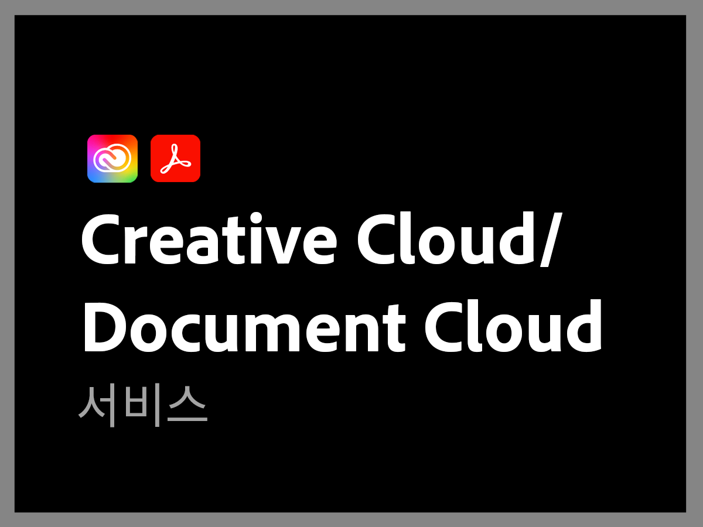

# Adobe 지원 개요

Adobe 지원 조직은 성공을 위해 최선을 다하고 있습니다. 모든 구독에는 기술 지원을 위해 고도로 숙련된 기술 리소스에 쉽게 액세스할 수 있게 하는 수준의 지원이 포함됩니다.

보다 포괄적인 요구 사항을 위해 Adobe는 지정된 지원 전문가에게 액세스할 수 있는 액세스와 사전 예방적인 멘토링 및 서비스 리뷰를 제공하는 Adobe 지원 서비스를 제공합니다. Adobe은 지원 요구 사항이 아무리 복잡해도 Adobe 솔루션을 통해 최상의 성능과 최적의 가치를 달성하는 데 필요한 기술 및 운영 전문 지식을 제공합니다.

<table style="table-layout:fixed">
<tr>
  <td>
    
    

    <a href="dx-overview.md"><strong>Experience Cloud 지원</strong></a>
    

    
Experience Cloud 및 Experience Platform 제품 지원 옵션

     
  </td>
  <td>
    
    

    <a href="dme-overview.md"><strong>Creative Cloud 엔터프라이즈 및 문서 지원</strong></a>
    

    
Creative Cloud 및 Document Cloud 제품 지원 옵션

     
  </td>
</tr>
</table>
